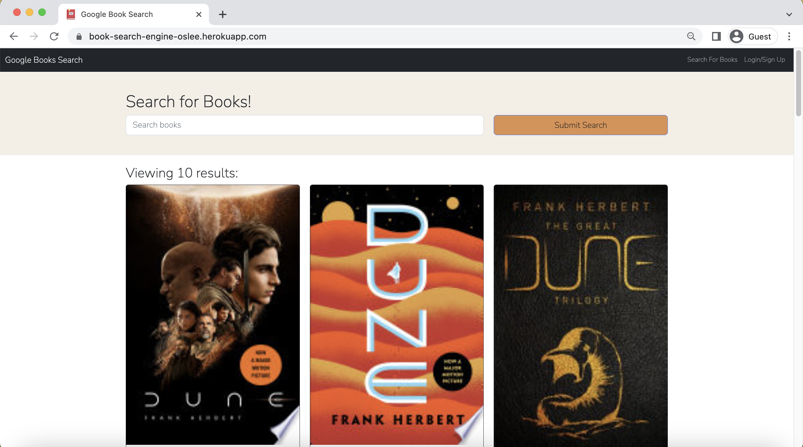

# Book Search Engine
## Description
This Book Search Engine is developed with a GraphQL API utilizing the MERSN stack, which consists of React for the front-end, MongoDB for the database, and Node.js/Express.js for the server and API. Users can search for books and save their book searches to their profile for future reference after signing up.
## Table of Contents
- [Installation](#Installation)
- [Live Site](#Live-site)
- [Preview](#Preview)
- [Technologies](#Technologies)
- [Questions](#Questions)

## Installation
- To use the application on your local machine, download or clone the repository. After navigating to the root directory, run the command npm i to install the necessary dependencies.

## Live Site
Live application deployed at: [Click here](https://oliviasylee.github.io/my-react-portfolio/)    

## Preview

| Search |
|----------------------|
| Users can search for books by search terms. |
| 

| Sign up | Login |
|-----------|-----------|
| ||

| Saved books |
|----------------------|
| Users can save searched books and view them in "See your books".  |
| 

## Technologies
- React.js
- JavaScript
- Node.js
- Express.js
- MongoDB & Mongoose
- GraphQL API
- Apollo Server
- JWT
- Bcrypt

## Questions
If you have any questions about this project, please contact me at oliviasylee@gmail.com. You can view more of my projects at https://github.com/oliviasylee.